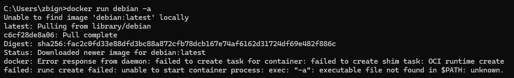

# DOCKER 

1. ``docker run ls -l``


wersja jądra systemu linux:
``docker run ubuntu uname -a``


pobranie obrazu lunux debian:


odpalenie konsoli bash w kontenerze z ubuntu   
``docker run --interactive --tty ubuntu bash``  
ale można też ``docker run -it ubuntu bash``


dodanie pliku :  


lista kontenerów:  
``docker container ls -a``    


działające kontenery:    
``docker containers ls``  
ale można ``docker ps``


Uruchomienie starego konteneru:  
``docker start  IdKontenera``


Uruchomienie pliku txt na kontenerze który został włączony:  
``docker exec ff224 cat skni.txt``  
warto wrócić uwagę że docker RUN zawsze tworzy nowy kontener, natomiast docker exec wykonuje polecenie najuż odpalonym kontenerze  
  


Stworzona nowa warstwa obrazu:   
``docker commit IdKontenera (nazwa_obrazu)``  


historia obrazu:  
``docker history (nazwa_obrazu)``
  


Na podstawie nowego obrazu tworzę kontener:
``docker run --it skni_img bash``  


instalacja vima w kontenerze:  


instalacja postgres'a:  
``docker pull postgres``  


zmiana nazwy obrazu:  
``docker tag nazwascr nazwa_docelowa``  


Kopiowanie
`docker cp --src-- -dest-`  

Dockerfile:
```bash
FROM ubuntu

COPY new_file.txt .

RUN apt-get update
RUN apt-get install --yes vim
```

``docker build --tag -img name- -path to dockerfile-``  


jeśli ścieżka do pliku docker nie znajduje się tam, gdzie budujemy, musimy dodać flagę -f  

### Docker 9
utwórz folder z kilkoma rzeczami

utwórz plik docker i skopiuj do niego nasze rzeczy

CMD -command-

### Docker 10

ADD jest jak kopiowanie, ale:

- może kopiować z adresów URL
- automatycznie rozpakowuje pliki tar  

WORKDIR -nazwa_katalogu- -> tworzy katalog i ustawia go jako główny (tj. wszystko dzieje się tam, a nie w katalogu głównym)


### Docker 11

ENTRYPOINT -["command1", ...]- -> działa jak cmd, ale jeśli przekażemy dodatkowe parametry podczas uruchamiania dockera, zostaną one dodane do ENTRYPOINT, a nie nadpisane (jak w przypadku CMD).


### Docker 12

Wolumin jest jak katalog, który utrzymuje się między uruchomieniami i kontenerami

docker volume create -name-

docker volume ls

``docker run --volume -volume name-:-catalogue it will replace-``  

teraz, gdy zmieniamy rzeczy w katalogu, zmiany te utrzymują się, ponieważ utworzony przez nas wolumin jest statyczny

nazwa wolumenu może być katalogiem lokalnym

### Doker 13

pozwala nam ustawić zmienne środowiskowe w kontenerach podczas wykonywania polecenia RUN

``... -e -name-=-value- ...``


### Doker 14

``docker inspect <ID>`` ->  Sformatowane dane json dotyczące kontenera/woluminu

### Doker 15

bridge network w dokerze łączy wszystkie kontenery przez sieć

``docker network create --driver[optional] -driver param- -name-``  
``docker network create --driver bridge myNetwork``  
``--network -nameOfNetwork-``  

pozwala nam podłączyć nasz kontener do dowolnej sieci

``docker network [connect/disconnect] -network name- -container name-``

pozwala nam podłączać/odłączać kontenery do sieci

``docker attach -container name- ``  
pozwala nam uzyskać dostęp do powłoki uruchomionego kontenera


### Doker 16

obraz administratora pozwala nam połączyć się z naszymi bazami danych

``docker run -p -container port-:-local port- --network -networkName- adminer``

### Doker 17

utworzyć plik docker-compose.yml

``docker-compose [up/down]``  

### DDoker 18

``docker-compose up -d --build``

### Doker 19

``nginx``  <- Nginx w kontenerach Docker służy do pełnienia różnych funkcji, takich jak serwer HTTP, reverse proxy, load balancer, oraz cache. Użycie Nginx w środowisku Docker może przynieść korzyści związane z łatwym zarządzaniem, skalowalnością oraz izolacją aplikacji.

### Doker 20
 
w jednym pliku docker możemy mieć wiele FROM`SÓW  
Dzięki temu możemy skonfigurować wiele kontenerów jednocześnie!


### Doker 21

``FROM scratch`` -> tworzy całkowicie pusty obraz  

Jest to dobre rozwiązanie, ponieważ zazwyczaj nie potrzebujemy wszystkiego w obrazie, możemy po prostu przekazać skompilowaną aplikację do środka bez żadnych niepotrzebnych plików (mniejsza waga, brak powłoki, brak możliwości debugowania w kontenerze, bezpieczniejsze).


### Doker 21

połączyć polecenia RUN (np. apt-get update && apt-get install ...) w jedno, aby utworzyć mniej warstw obrazu i zaoszczędzić czas i miejsce


.dockerignore działa tak samo jak .gitignore